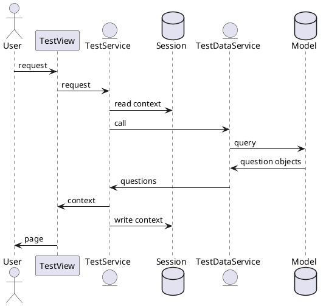

# TestService

## Sequence diagram

[!Sequence Diagram](img/test_service_seqdiag.svg)

```plantuml
@startuml

actor         User                as U
participant   TestView            as V
entity        TestService         as TS
database      Session             as S
entity        TestDataService     as TD
database      Model               as M

U  -> V   : request
V  -> TS  : request
TS -> S   : read context
TS -> TD  : call
TD -> M   : query
M  -> TD  : question objects
TD -> TS  : questions
TS -> V   : context
TS -> S   : write context
V  -> U   : page

@enduml
```